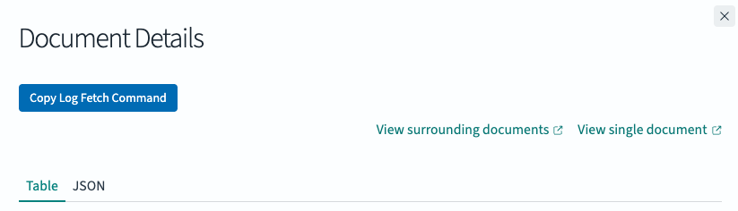

# elk

A collection of Tampermonkey userscripts for tweaking the ELK/OpenSearch stack.

## Scripts

### `opensearch-copy-log-fetch-command.js`

Adds a **"Copy Log Fetch Command"** button to the OpenSearch document detail flyout. When clicked, it reads log fields (`agent.hostname`, `kubernetesClusterName`, `kubernetesPodName`, `msg`) from the open document and builds a ready-to-paste `grunt admin:log_fetch` command, then copies it to your clipboard.

**Matches:**
- `https://opensearch-applogs.shadowbox.cloud/*`
- `https://opensearch-applogs.staging-shadowbox.cloud/*`



**Example output:**
```
grunt admin:log_fetch:fetchMatchingLogMessageFromHost --hostname=<hostname> --cluster=<cluster> --pod=<pod> --search='crud request log line'
```
