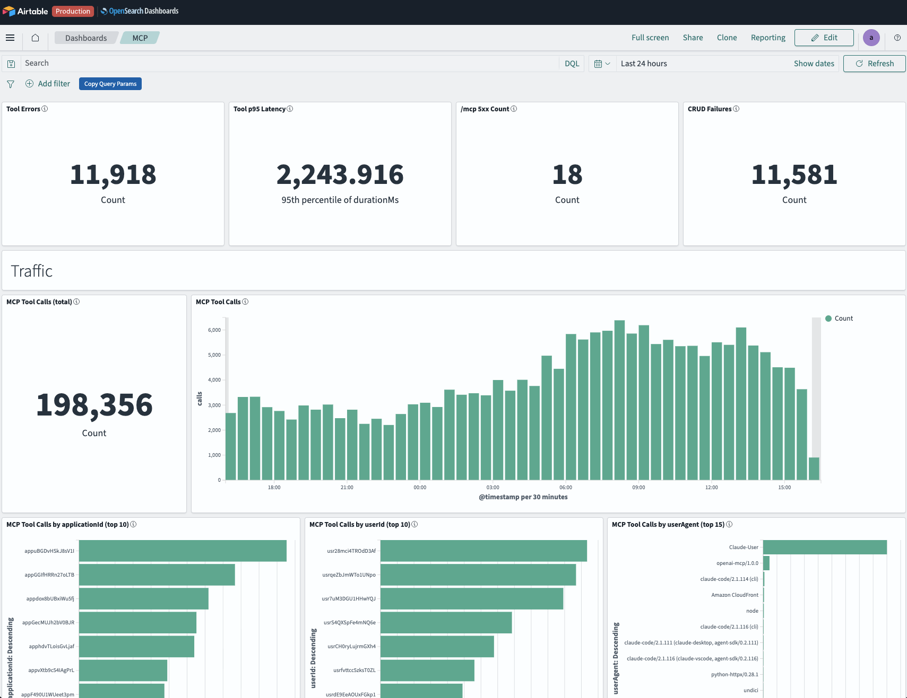
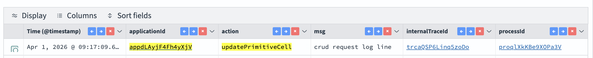
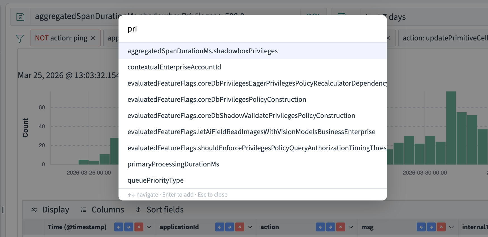

# elk

A collection of Tampermonkey userscripts for tweaking the ELK/OpenSearch stack, plus version-controlled OpenSearch Dashboards saved objects.

## Dashboards

OpenSearch Dashboards saved objects exported as NDJSON and versioned under [`dashboards/`](dashboards/). Python helpers in [`dashboards/scripts/`](dashboards/scripts/) handle export, diff, import, and programmatic viz authoring against alpha / staging / prod.

### MCP Dashboard

Observability dashboard for the MCP service — traffic, latency, errors, CRUD behaviour, and infrastructure health.



| Env | URL |
| --- | --- |
| prod | <https://opensearch-applogs.shadowbox.cloud/_dashboards/app/dashboards#/view/db007be0-3dab-11f1-83bb-619bc5d820fb> |
| staging | <https://opensearch-applogs.staging-shadowbox.cloud/_dashboards/app/dashboards#/view/db007be0-3dab-11f1-83bb-619bc5d820fb> |

**Sections:** on-call metrics row · Traffic (volume, top callers, active sessions) · Performance (latency by outcome, CRUD latency breakdown, queue pressure, fan-out ratio) · Errors (HTTP error rate, CRUD failures) · Infrastructure (heap, event loop utilization).

### Working with dashboards

Auth reuses the encrypted cookie cache from the hyperbase `opensearch_query` CLI — log in once per env, then the scripts pick up the cookies:

```bash
cd ~/h/source/hyperbase
./bin/opensearch_query --env <alpha|staging|prod> login
```

Common operations:

```bash
# Pull latest dashboard state from prod into git
python3 dashboards/scripts/osd_export.py prod <dashboard-id> dashboards/<slug>/

# Preview what would change before importing
python3 dashboards/scripts/osd_diff.py staging dashboards/<slug>/dashboard.ndjson

# Push local file to an env
python3 dashboards/scripts/osd_import.py staging dashboards/<slug>/dashboard.ndjson

# Test auth
python3 dashboards/scripts/osd_common.py --selftest staging
```

Authoring sharp edges (indexRefName wiring, stringified JSON, aggregatability) are captured in the [`opensearch-dashboard-sync` Claude skill](.claude/skills/opensearch-dashboard-sync/).

## Scripts

Tampermonkey userscripts live in [`tweaks/`](tweaks/).

### `opensearch-copy-log-fetch-command.js`

Adds a **"Copy Log Fetch Command"** button to the OpenSearch document detail flyout. When clicked, it reads log fields (`agent.hostname`, `kubernetesClusterName`, `kubernetesPodName`, `msg`) from the open document and builds a ready-to-paste `grunt admin:log_fetch` command, then copies it to your clipboard.

**Matches:**
- `https://opensearch-applogs.shadowbox.cloud/*`
- `https://opensearch-applogs.staging-shadowbox.cloud/*`


---

### `opensearch-copy-query-params.js`

Adds a **"Copy Query Params"** button to the OpenSearch filter bar. Copies the current DQL query, time range, index pattern, and active filters as a JSON object.

**Matches:**
- `https://opensearch-applogs.shadowbox.cloud/*`
- `https://opensearch-applogs.staging-shadowbox.cloud/*`


**Example output:**
```json
{
  "query": "aggregatedSpanDurationMs.shadowboxPrivileges > 500.0",
  "timeRange": "Last 24 hours",
  "filters": [
    {
      "key": "action",
      "value": "ping",
      "negated": true
    },
    {
      "key": "applicationId",
      "value": [
        "appAL6oDwdQZtJf7B",
        "appEeYga5PYHiGnXw",
        "appdLAyjF4Fh4yXjV"
      ],
      "negated": false
    },
    {
      "key": "action",
      "value": "updatePrimitiveCell",
      "negated": false
    }
  ]
}
```

**Example output:**
```
grunt admin:log_fetch:fetchMatchingLogMessageFromHost --hostname=<hostname> --cluster=<cluster> --pod=<pod> --search='crud request log line'
```

---

### `opensearch-make-model-ids-clickable.js`

Makes model IDs in the OpenSearch data grid clickable. Detects ID prefixes and linkifies them:

| Prefix | Links to |
|--------|----------|
| `trc`, `act`, `req`, `pgl`, `pro`, `wkr` | OpenSearch Discover filtered by that ID |
| `app`, `usr` | Support panel |
| `pbd`, `pag` | Support panel at `applicationId#pageBundleId` / `applicationId#pageId` (resolved from the same row; falls back to unlinked if `applicationId` column is not visible) |

Uses CSS styling + click delegation rather than DOM mutation, which correctly handles EUI DataGrid's virtual scrolling (cell recycling no longer causes stale/overwritten links).

**Matches:**
- `https://opensearch-applogs.shadowbox.cloud/*`
- `https://opensearch-applogs.staging-shadowbox.cloud/*`

---

### `opensearch-column-manager.js`

Adds **← → ×** buttons to each column header for one-click reorder and remove. Also supports keyboard shortcuts when a header is focused: `Shift+←` / `Shift+→` to move, `Shift+X` to remove.

Column operations go through `location.hash` (the URL parameter OpenSearch Discover uses as source of truth for column config) rather than React internals, so they're resilient to EUI/OpenSearch upgrades.

**Matches:**
- `https://opensearch-applogs.shadowbox.cloud/*`
- `https://opensearch-applogs.staging-shadowbox.cloud/*`



---

### `opensearch-field-search.js`

**Cmd+J** (Mac) / **Ctrl+J** (Win) opens a search modal to quickly find and add fields to the grid. Already-added fields are shown with an `added` badge. Uses `location.hash` to add columns, same as the column manager.

**Matches:**
- `https://opensearch-applogs.shadowbox.cloud/*`
- `https://opensearch-applogs.staging-shadowbox.cloud/*`


