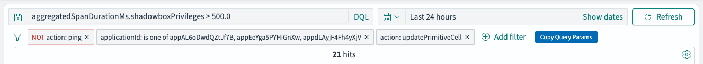

# elk

A collection of Tampermonkey userscripts for tweaking the ELK/OpenSearch stack.

## Scripts

### `opensearch-copy-log-fetch-command.js`

Adds a **"Copy Log Fetch Command"** button to the OpenSearch document detail flyout. When clicked, it reads log fields (`agent.hostname`, `kubernetesClusterName`, `kubernetesPodName`, `msg`) from the open document and builds a ready-to-paste `grunt admin:log_fetch` command, then copies it to your clipboard.

**Matches:**
- `https://opensearch-applogs.shadowbox.cloud/*`
- `https://opensearch-applogs.staging-shadowbox.cloud/*`


---

### `opensearch-copy-query-params.js`

Adds a **"Copy Query Params"** button to the OpenSearch filter bar. Copies the current DQL query, time range, index pattern, and active filters as a JSON object.

**Matches:**
- `https://opensearch-applogs.shadowbox.cloud/*`
- `https://opensearch-applogs.staging-shadowbox.cloud/*`



**Example output:**
```json
{
  "query": "aggregatedSpanDurationMs.shadowboxPrivileges > 500.0",
  "timeRange": "Last 24 hours",
  "filters": [
    {
      "key": "action",
      "value": "ping",
      "negated": true
    },
    {
      "key": "applicationId",
      "value": [
        "appAL6oDwdQZtJf7B",
        "appEeYga5PYHiGnXw",
        "appdLAyjF4Fh4yXjV"
      ],
      "negated": false
    },
    {
      "key": "action",
      "value": "updatePrimitiveCell",
      "negated": false
    }
  ]
}
```

**Example output:**
```
grunt admin:log_fetch:fetchMatchingLogMessageFromHost --hostname=<hostname> --cluster=<cluster> --pod=<pod> --search='crud request log line'
```

---

### `opensearch-make-model-ids-clickable.js`

Makes model IDs in the OpenSearch data grid clickable. Detects ID prefixes and linkifies them:

| Prefix | Links to |
|--------|----------|
| `trc`, `act`, `req`, `pgl`, `pro`, `wkr` | OpenSearch Discover filtered by that ID |
| `app`, `usr` | Support panel |
| `pbd`, `pag` | Support panel at `applicationId#pageBundleId` / `applicationId#pageId` (resolved from the same row; falls back to unlinked if `applicationId` column is not visible) |

Uses CSS styling + click delegation rather than DOM mutation, which correctly handles EUI DataGrid's virtual scrolling (cell recycling no longer causes stale/overwritten links).

**Matches:**
- `https://opensearch-applogs.shadowbox.cloud/*`
- `https://opensearch-applogs.staging-shadowbox.cloud/*`
